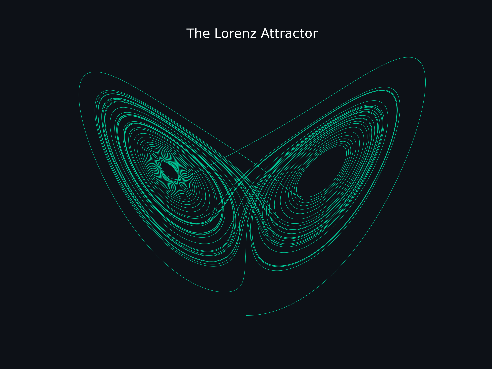

# Numerical Analysis From Scratch Using Python

Skills in numerical analysis are crucial for an undergraduate student in physics. Numerical analysis is used in computational physics - problems in physics that only a computer can solve. We seek to study selected algorithms and implement them in a Python program using a from-scratch approach. Specifically, we restrict ourselves to using NumPy and loops in implementing the algorithms. If we have a sufficient understanding of the algorithms, we will then use the corresponding SciPy packages to make our lives easier. The references used in this repository are [Mark Newman's Computational Physics](https://www.amazon.com/gp/product/1480145513?pf_rd_r=91M45TC3S5P9JF5QV3VZ&pf_rd_p=8fe9b1d0-f378-4356-8bb8-cada7525eadd&pd_rd_r=f1ab17ad-f603-4aaf-9a49-573312ed2812&pd_rd_w=HNwcL&pd_rd_wg=1Nt1e&ref_=pd_gw_unk) and [Alex Gezerlis' Numerical Methods in Physics with Python](https://www.amazon.com/Numerical-Methods-Physics-Python-Gezerlis/dp/1108738931/ref=sr_1_1?dchild=1&keywords=alex+gezerlis&qid=1628768170&s=books&sr=1-1). Topics include:

## 0 Linear Algebra
* TBA

## 1 Numerical Differentiation
* Finite Differences Methods
* Partial Differentiation

## 2 Interpolation
* TBA

## 3 Root-Finding
* One-Dimensional Root-Finding Algorithms
* Zeros of Polynomials
* System of Equations
* 3D Minimization

## 4 Numerical Integration
* Newton-Cotes Methods
* Integration with Infinite Domain
* Gaussian Quadrature
* Higher-dimensional Integrals
* Monte-Carlo Integration

## 5 Fourier Analysis
* Fourier Series
* Discrete Fourier Transform (DFT)
* Fast-Fourier Transform (FFT)

## 6 Differential Equations
* First-Order Differential Equations (ODEs)
* Euler Method
* 2nd- and 4th-order Runge-Kutta Methods
* System of 1st-order ODEs
* Solving 2nd-order ODEs (with examples and animations)
* System of 2nd-order ODEs (with examples and animations)
* Boundary Value Problems
* Eigenvalue Problems
* Solving ODEs using SciPy
* Partial Differential Equations (PDEs)